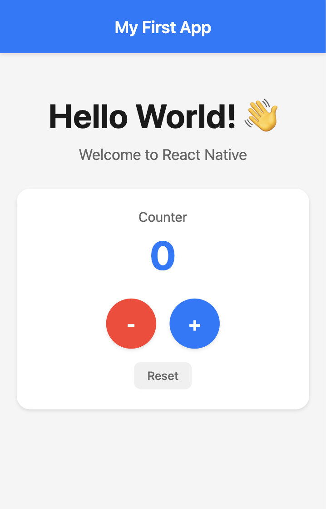

# Hello World

## Objectifs

Dans ce premier exercice, vous apprendrez à :

| Compétence   | Description                                                                |
| ------------ | -------------------------------------------------------------------------- |
| Interface    | Créer une interface utilisateur structurée avec en-tête et zone de contenu |
| État         | Gérer l'état local avec useState pour un compteur interactif               |
| Style        | Appliquer des styles professionnels et créer des composants réutilisables  |
| Design       | Implémenter des retours visuels et des animations de pression              |

Voici à quoi ressemblera votre application finale :

<div align="center">
  
</div>

## Étape 1 : Lancer le projet

Commencez par naviguer vers le dossier de l'exercice et installer les dépendances :

```bash
cd 01-hello-world
npm install
```

Puis lancez le projet :

```bash
npx expo start
```

!!! info
    Si vous rencontrez des problèmes de connexion, essayez de lancer le projet avec le tunnel :

    ```bash
    npx expo start --tunnel
    ```

## Étape 2 : Créer la page Hello World

Votre projet tourne, mais il est vide. Ajoutons une page simple avec un composant texte. Allez dans le fichier `app/index.tsx` et ajoutez le code suivant :

```tsx
import { StyleSheet, Text, View } from "react-native";

export default function Page() {
  return (
    <View>
      <Text>Hello World</Text>
    </View>
  );
}
```

## Étape 3 : Ajouter un compteur

Ajoutons de l'interactivité à notre application avec un compteur. Nous utiliserons le hook `useState` pour gérer l'état du compteur. Le hook `useState` permet de suivre les valeurs qui peuvent changer au fil du temps.

Importez le hook `useState` et ajoutez-le à votre composant :

```tsx
import { StyleSheet, Text, View, Pressable, SafeAreaView } from "react-native";
import { useState } from "react";
```

Ajoutez un composant `SafeAreaView` pour éviter que le contenu soit masqué par les trous noirs :

```tsx
export default function Page() {
  const [count, setCount] = useState(0);

  return (
    <SafeAreaView>
      <View>
        <Text>Hello World</Text>
      </View>
    </SafeAreaView>
  );
}
```

!!! info
    `SafeAreaView` automatiquement ajoute un padding pour éviter que le contenu soit masqué par :

    - Les trous noirs sur les iPhones
    - Les coins arrondis

Maintenant que nous avons une variable `count`, nous pouvons l'utiliser dans le composant `Text` :

```tsx
<Text>{count}</Text>
```

Créons des boutons pour contrôler le compteur. Nous utiliserons `Pressable` au lieu du composant `Button` de base car il offre de meilleures options de style et de retour visuel :

```tsx
<View>
  <Pressable onPress={() => setCount(count + 1)}>
    <Text>Increment</Text>
  </Pressable>
</View>
```

Il est possible d'utiliser le composant `Button` de base, mais il ne permet pas de personnaliser les styles et les retours visuels :

```tsx
<View>
  <Button title="Increment" onPress={() => setCount(count + 1)} />
</View>
```

!!! example "Tâche"
    Créez un bouton de decrementation qui :

    - Décrémente le compteur lorsqu'il est pressé
    - Utilise le composant `Pressable`
    - Utilise `Math.max(0, prev - 1)` pour éviter que le compteur soit négatif

    Créez un bouton de réinitialisation qui :

    - Réinitialise le compteur à 0 lorsqu'il est pressé
    - Utilise le composant `Pressable`

## Étape 4 : Appliquer des styles à l'application

Ajoutons des styles à notre application étape par étape :

À ce stade, votre code devrait ressembler à ceci :

```tsx
export default function Page() {
  const [count, setCount] = useState(0);

  return (
    <SafeAreaView>
      <View>
        <Text>Hello World</Text>
      </View>
      <View>
        <Text>{count}</Text>
        <View>
          ...
          <Pressable onPress={() => setCount((prev) => prev + 1)}>
            <Text>+</Text>
          </Pressable>
          ...
        </View>
      </View>
    </SafeAreaView>
  );
}
```

Pour ajouter des styles, nous devons simplement créer une constante `styles` et ajouter les styles aux composants.

```tsx
const styles = StyleSheet.create({
  container: {
    flex: 1,
    backgroundColor: "#f5f5f5",
  },
  header: {
    backgroundColor: "#007AFF",
    padding: 20,
    alignItems: "center",
  },
  headerText: {
    color: "white",
    fontSize: 20,
    fontWeight: "600",
  },
  main: {
    flex: 1,
    alignItems: "center",
    justifyContent: "center",
    padding: 20,
  },
  counterNumber: {
    fontSize: 48,
    fontWeight: "bold",
    color: "#007AFF",
    marginBottom: 24,
  },
  buttonGroup: {
    flexDirection: "row",
    gap: 16,
    marginBottom: 16,
  },
  button: {
    width: 60,
    height: 60,
    borderRadius: 30,
    justifyContent: "center",
    alignItems: "center",
    backgroundColor: "#FF3B30",
  },
  incrementButton: {
    backgroundColor: "#007AFF",
  },
  buttonText: {
    color: "white",
    fontSize: 24,
    fontWeight: "600",
  },
  resetButton: {
    padding: 10,
    backgroundColor: "#f0f0f0",
    borderRadius: 8,
  },
  resetButtonText: {
    color: "#666",
    fontSize: 14,
  },
});
```

En React Native, vous pouvez combiner plusieurs styles en utilisant un tableau. Ceci est utile lorsque vous souhaitez :

- Appliquer des styles de base et des variations
- Ajouter des styles conditionnels
- Remplacer des propriétés spécifiques

Voici comment combiner des styles :

```tsx
// Style de base application
<View style={styles.button}>
  <Text>Basic Button</Text>
</View>

// Combinaison de deux styles
<View style={[styles.button, styles.incrementButton]}>
  <Text>Combined Styles</Text>
</View>
```

Dans notre application de compteur, nous utilisons ceci pour créer différentes variations de boutons :

```tsx
// Bouton de decrementation (rouge)
<Pressable style={styles.button}>
  <Text>-</Text>
</Pressable>

// Increment button (blue)
<Pressable style={[styles.button, styles.incrementButton]}>
  <Text>+</Text>
</Pressable>
```

Le second style dans le tableau remplacera les propriétés en double du premier style.

!!! example "Essayez-vous-même !"
    1. Ajoutez les styles aux composants corrects
    2. Créez une nouvelle variation de bouton avec une couleur différente
    3. Essayez de combiner trois ou plus de styles
    4. Créez un état sélectionné pour les boutons
