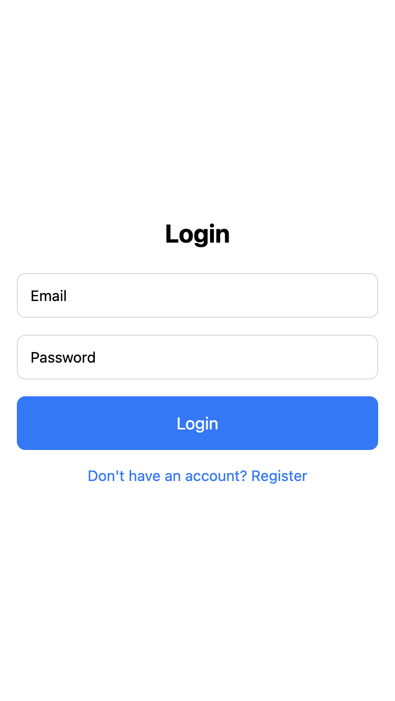
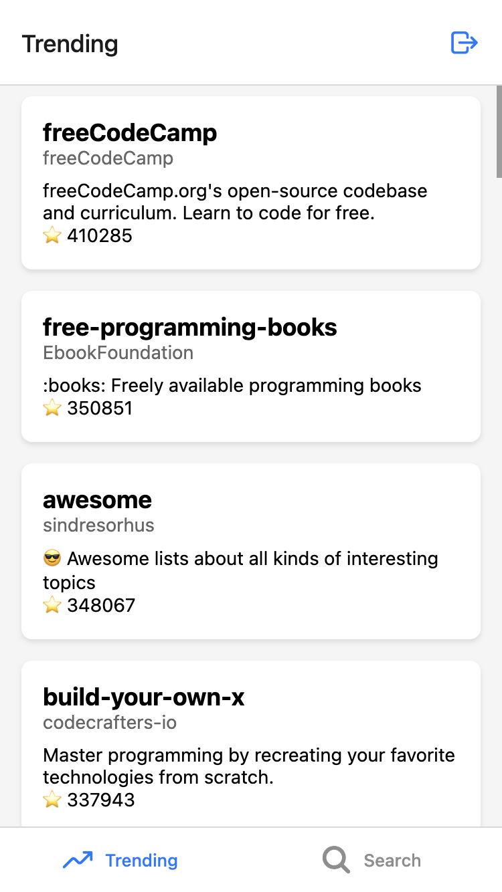

# DevHub

## Objectifs

Dans cet exercice, vous apprendrez à :

| Compétence | Description                                            |
| ---------- | ------------------------------------------------------ |
| Auth       | Implémenter l'authentification avec GitHub             |
| API        | Intégrer l'API GitHub et Supabase                      |
| État       | Synchroniser les données entre le client et le serveur |

Voici à quoi ressemblera votre application finale :

{ width="300" }
{ width="300" }

## Étape 0 : Lancer le projet

Commencez par naviguer vers le dossier de l'exercice et installer les dépendances :

```bash
cd 03-devhub
npm install
```

Puis lancez le projet :

```bash
npx expo start
```

!!! info
    Si vous rencontrez des problèmes de connexion, essayez de lancer le projet avec le tunnel :

    ```bash
    npx expo start --tunnel
    ```

## Étape 1 : Créer un projet Supabase

### 1.1 Créer un projet Supabase

Créez un nouveau projet sur [Supabase](https://supabase.com) :

1. Connectez-vous à votre compte Supabase
2. Créez un nouveau projet
3. Notez l'URL et la clé d'API de votre projet

### 1.2 Variables d'environnement

On va copier le fichier `.env.example` et le renommer en `.env`. C'est dans ce fichier que vous mettrez votre clé d'API Supabase.

```bash
cp .env.example .env
```

Ouvrez le fichier `.env` et remplacez les valeurs par vos propres valeurs.

```bash
EXPO_PUBLIC_SUPABASE_URL=
EXPO_PUBLIC_SUPABASE_ANON_KEY=
```

### 1.3 Gestion du Login et Register

Pour la gestion du login et register, nous allons utiliser le SDK de Supabase. Pour cela dans le dossier `lib` on va créer un fichier `supabase.ts`. Dans ce dossier on retrouve nos variables d'environnement. Expo permet de faire appel à ces variables pour autant qu'elles possèdent le préfixe `EXPO_PUBLIC_`.

```typescript title="lib/supabase.ts"
import "react-native-url-polyfill/auto";
import { createClient } from "@supabase/supabase-js";

const supabaseUrl = process.env.EXPO_PUBLIC_SUPABASE_URL;
const supabaseAnonKey = process.env.EXPO_PUBLIC_SUPABASE_ANON_KEY;

if (!supabaseUrl || !supabaseAnonKey) {
  throw new Error("Missing Supabase environment variables");
}

export const supabase = createClient(supabaseUrl, supabaseAnonKey);
```

Maintenant qu'on a notre client Supabase, on va pouvoir l'utiliser dans notre application. Nous allons completer les pages login et register dans le dossier `app/auth`.

```typescript title="app/auth/register.tsx"
async function signUp() {
  if (!email || !password) {
    Alert.alert("Error", "Please fill in all fields");
    return;
  }

  setLoading(true);
  try {
    // TODO: Ajouter le SignUp avec le SDK de Supabase

    if (error) throw error;

    if (data.session) {
      router.replace("/(tabs)");
    } else {
      Alert.alert(
        "Success",
        "Registration successful. Please check your email.",
        [{ text: "OK", onPress: () => router.replace("/auth/login") }]
      );
    }
  } catch (error) {
    Alert.alert("Error", (error as Error).message);
  } finally {
    setLoading(false);
  }
}
```

```typescript title="app/auth/login.tsx"
async function signIn() {
  if (!email || !password) {
    Alert.alert("Error", "Please fill in all fields");
    return;
  }

  setLoading(true);
  try {
    console.log("Tentative de connexion avec:", email);
    // TODO: Ajouter la connexion avec le SDK de Supabase

    console.log("Réponse Supabase:", { data, error });

    if (error) throw error;

    console.log("Connexion réussie, redirection...");
    router.replace("/(tabs)");
  } catch (error) {
    console.error("Erreur de connexion:", error);
    Alert.alert("Error", (error as Error).message);
  } finally {
    setLoading(false);
  }
}
```

!!! example "Tâche"
    Completer le script `login` et le script `register` pour qu'ils utilisent le SDK de Supabase pour faire le SignUp et le SignIn:

    - Importer le script `supabase.ts` dans `login` et `register`.
    - Ajoutez les textInput pour l'email et le mot de passe. assurez vous que le mot de passe soit masqué.
    - Completez la fonction `signUp` en utilisant la fonction `signUp`: [Documentation](https://supabase.com/docs/reference/javascript/auth-signup)
    - Completez la fonction `signIn` en utilisant la fonction `signInWithPassword`: [Documentation](https://supabase.com/docs/reference/javascript/auth-signinwithpassword).

    !!! tip "Conseil"
        Pour cacher le mot de passe, vous pouvez utiliser le composant `TextInput` avec l'attribut `secureTextEntry`.

### 1.4 Gestion du Layout

L'application aura 2 layouts. Le layout qui se trouve dans le dossier `app` est le layout racine de l'application. Il est utilisé pour l'authentification et le layout `(tabs)/_layout.tsx` sera utilisé pour les onglets (trending et recherche).

Le premier layout est le suivant. Il permet de rediriger l'utilisateur vers la page de login si il n'est pas connecté et vers la page des onglets si il est connecté. Pour cela la variable session est utilisée.

```typescript title="app/_layout.tsx"
import { useEffect, useState } from "react";
import { Slot, useRouter, useSegments } from "expo-router";
import { supabase } from "../lib/supabase";
import { Session } from "@supabase/supabase-js";

export default function RootLayout() {
  const [session, setSession] = useState<Session | null>(null);
  const segments = useSegments();
  const router = useRouter();

  useEffect(() => {
    //1. verifier si l'utilisateur est connecté
    supabase.auth.getSession().then(({ data: { session } }) => {
      setSession(session);
    });

    //2. écouter les changements d'état de la session
    supabase.auth.onAuthStateChange((_event, session) => {
      setSession(session);
    });
  }, []);

  useEffect(() => {
    const inAuthGroup = segments[0] === "auth";

    if (!session && !inAuthGroup) {
      router.replace("/auth/login");
    } else if (session && inAuthGroup) {
      router.replace("/(tabs)");
    }
  }, [session, segments]);

  return <Slot />;
}
```

Le deuxième layout est le suivant. Il permet de gérer les onglets (trending et recherche).

```typescript title="app/(tabs)/_layout.tsx"
import { Tabs } from "expo-router";
import { Ionicons } from "@expo/vector-icons";
import { TouchableOpacity, Alert } from "react-native";
import { useRouter } from "expo-router";

export default function TabsLayout() {
  const router = useRouter();

  async function handleLogout() {
    try {
      const { error } = await supabase.auth.signOut();
      if (error) throw error;
      router.replace("/auth/login");
    } catch (error) {
      Alert.alert("Error logging out", (error as Error).message);
    }
  }

  return (
    <Tabs
      screenOptions={{
        tabBarActiveTintColor: "#007AFF",
        headerRight: () => (
          <TouchableOpacity onPress={handleLogout} style={{ marginRight: 16 }}>
            <Ionicons name="log-out-outline" size={24} color="#007AFF" />
          </TouchableOpacity>
        ),
      }}
    >
      <Tabs.Screen
        name="index"
        options={{
          title: "Trending",
          tabBarIcon: ({ color, size }) => (
            <Ionicons name="trending-up" size={size} color={color} />
          ),
        }}
      />
      <Tabs.Screen
        name="search"
        options={{
          title: "Search",
          tabBarIcon: ({ color, size }) => (
            <Ionicons name="search" size={size} color={color} />
          ),
        }}
      />
    </Tabs>
  );
}
```

## Étape 2 : API GitHub

Dans la page Home, on veut afficher la liste des repositories trending. Pour cela faut récupérer les repositories trending avec l'API de GitHub. Dans le dossier `lib` on peut voir le fichier `github.ts` qui contient la configuration de l'API GitHub.

Dans ce dossier on retrouve le type `Repository` qui représente un repository GitHub.

```typescript
type Repository = {
  id: number;
  name: string;
  owner: {
    login: string;
  };
  description: string;
  stargazers_count: number;
  html_url: string;
};
```

Nous avons egalement deux fonctions qui permettent de récupérer les repositories trending et les repositories recherchés:

```typescript
export const github = {
  // Obtenir les repos tendance (limité à 30 résultats)
  getTrendingRepos: () =>
    fetchFromGitHub<Repository>(
      "/search/repositories?q=stars:>1&sort=stars&order=desc&per_page=30"
    ),

  // Rechercher des repos
  searchRepos: (query: string) =>
    fetchFromGitHub<Repository>(
      `/search/repositories?q=${encodeURIComponent(query)}&per_page=30`
    ),
};
```

Dans le fichier `app/(tabs)/index.tsx` on va récupérer et afficher les repositories trending.

!!! example "Tâche"
    Dans le fichier `app/(tabs)/index.tsx` on doit récupérer les repositories trending et les afficher avec une FlatList:

    - Récupérer les repositories trending avec la fonction `getTrendingRepos`. Pour cela faites appel à la fonction `getTrendingRepos` et mettez à jour le useState `repos` avec les repositories trending.
    - Afficher les repositories trending avec une FlatList. Vous pouvez soit utiliser le composant `RepoCard` ou créer votre propre composant ou utiliser des variables Text et View.

## Étape 3 : Recherche de repositories

Dans le fichier `app/(tabs)/search.tsx` on va ajouter une fonction pour rechercher des repositories.

!!! example "Tâche"
    Dans le fichier `app/(tabs)/search.tsx` on doit récupérer les repositories recherchés et les afficher avec une FlatList:

    - Récupérer les repositories trending avec la fonction `getTrendingRepos`. Pour cela faites appel à la fonction `getTrendingRepos` et mettez à jour le useState `repos` avec les repositories trending.
    - Afficher les repositories trending avec une FlatList. Vous pouvez soit utiliser le composant `RepoCard` ou créer votre propre composant ou utiliser des variables Text et View.
